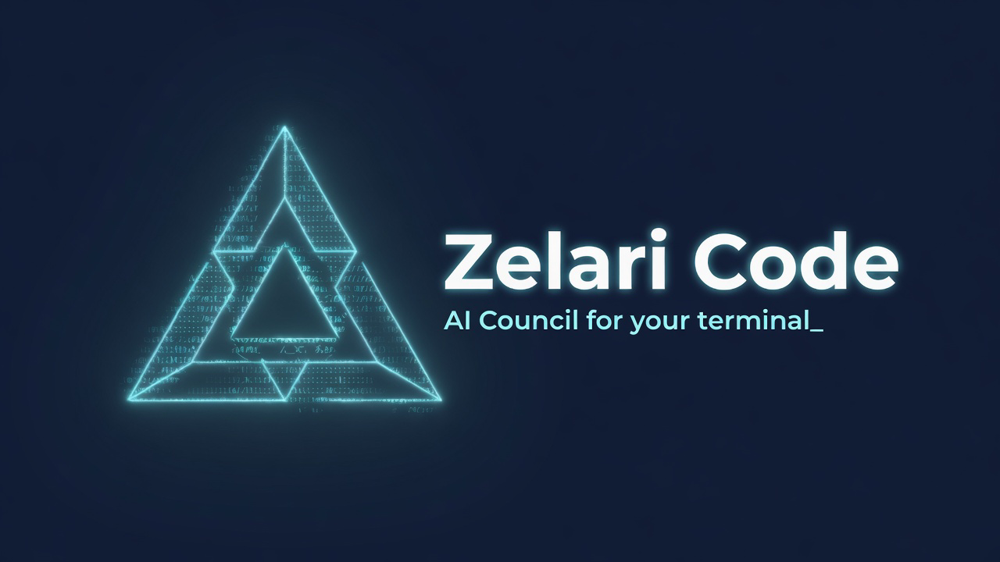

# Zelari Code

```
             -#%=
           .*%%%@#:
          =%%%%%%%@*
         +%%%%%%%%%%#.
        +%%%@@@@@@@%@#.
      .*%@@@@@@@@@@@@@%-
     .#%@@@@@@@@@@@@@@@@-
     *%@@@@@@@@@@@@@@@@@%.
    :@%%@@@@@@%:+%@@@@@%@=
     =@%%@@@@@%.=-+%@%%@*
     .=@@%@@@@%.*@*-+@@*.
   -*%@@@@@@@@%.*@@@+:#@@#=.
  *%%%%%%@@@@@@.*#%#=-:+@@@%
 :@%%%%%%@@@@@@.:=.*:*@@@@@@=
 *@%%@%%@@@@@@@*%@*:-:%@@@@@%.
:@@@%@@@@@@@@@@@@@@#%@@@@@@@@=
*%%%%%%%%%%%%%%%%%%%%%%%%%%%%#

     Z E L A R I   C O D E
        Anathema Studio
```

> AI Council coding agent CLI — multi-agent orchestration with slash commands, provider-agnostic LLM streaming, and self-update.


By **[Anathema Studio](https://anathema-studio.com/)** ·
[Product page](https://anathema-studio.com/zelari-code) ·
[GitHub](https://github.com/N-THEM-Studio/zelari-code) ·
[npm](https://www.npmjs.com/package/zelari-code) ·
[Contributing](./CONTRIBUTING.md) ·
[Security](./SECURITY.md)



**Trailer (EN, ~30s):** [docs/media/trailer/zelari-code-trailer.mp4](./docs/media/trailer/zelari-code-trailer.mp4) · [media kit](./docs/media/README.md)

📖 **[Full user guide (IT)](./docs/GUIDA.md)** — install, TUI, slash commands, council, skills, workspace, headless, MCP, Desktop.

**Zelari Code** is an open-source **AI council coding agent** for the terminal: a multi-agent pipeline (Caronte, Nettuno, Gerione, Plutone, Minosse, Lucifero), a single-agent mode for focused work, and optional **zelari** missions that loop until a deliverable is done. It ships a rich TUI (Ink + React), slash commands, plan/build phases, and provider-agnostic LLM streaming (OpenAI-compatible, xAI Grok with OAuth, GLM/Z.AI, MiniMax, DeepSeek). The reusable runtime is published as **[`@zelari/core`](https://www.npmjs.com/package/@zelari/core)** (MIT).

```bash
npm install -g zelari-code
zelari-code
```

## Prerequisites

| Requirement | Version | Notes |
|---|---|---|
| **Node.js** | **≥ 20 LTS** | Earlier versions lack stable `fetch`, `AbortController.timeout`, and `node:test`. Works on 20.x and 22.x. |
| **npm** | **≥ 10** | Ships with Node 20 LTS; tested with npm 10 and 11. |
| **OS** | Linux, macOS, Windows 10/11 | Tested on Pop!_OS 24.04, macOS 15, Windows 11. Windows requires Git Bash (auto-detected). |
| **Disk** | ~50 MB for the CLI + `@zelari/core` | Models are not bundled — provider APIs are remote. |
| **Account + API key** | 1 of: xAI Grok, OpenAI-compatible, GLM/Z.AI, MiniMax, DeepSeek | OAuth Grok supported via `/login grok`. |

### Optional (advanced tools)

These are **opt-in** — the CLI runs fine without them. The agent auto-skips a tool if its dependency is missing.

| Tool group | Dependency | Used by |
|---|---|---|
| `lsp_*` | Language server on PATH (e.g. `typescript-language-server`, `pyright-langserver`) + Node/Python LSP client libs | `lsp_definition`, `lsp_references`, `lsp_hover`, `lsp_symbols`, `lsp_rename` |
| `ast_*` | *(none)* | `ast_outline`, `ast_find_symbol` — TypeScript Compiler API, no LSP needed |
| `semantic_search` | Local embedding model (default `Xenova/all-MiniLM-L6-v2` via `@xenova/transformers`, downloads on first use) | `semantic_search`, `/index` |
| `browser_check` | Playwright (`npx playwright install chromium` once, ~150 MB) | `browser_check` |
| diagnostics loop | `eslint` and/or `ruff` on PATH (project-local preferred) | post-edit compile/lint feedback |

Disable any tool group: set `ZELARI_LSP=0`, `ZELARI_AST=0`, `ZELARI_SEMANTIC=0`, `ZELARI_BROWSER=0`, `ZELARI_DIAGNOSTICS=0`.

## Install

If you already ran `npm install -g zelari-code` above, skip to [First Run](#first-run).

```bash
npm install -g zelari-code
zelari-code --doctor   # recommended once on Windows
```

### Optional: Zelari Desktop (Tauri)

An installable GUI shell lives in `apps/desktop/`. It does **not** replace the CLI — it streams `zelari-code --headless` into a modern chat UI. GitHub Releases attach platform installers on each `v*` tag.

> **Installer ≠ CLI.** Downloading Desktop from GitHub does **not** install or upgrade the global `zelari-code` package. Use `npm i -g zelari-code` (or Desktop → Settings → **Update CLI**). First launch shows a Setup guide when Node/CLI is missing.

**Desktop highlights:** Mode / Phase / Provider bar · Files|Git project panel · Settings (provider keys, App updates, **Update CLI**, **MCP Extensions**, **SSH Connections**) · multi-turn chat history · optional overlay HUD · password/agent/key SSH targets (`ssh_status` / `ssh_run`).

```bash
npm run build                 # CLI side-car
npm run desktop:install
npm run desktop:dev           # Tauri dev window
# npm run desktop:build       # MSI / NSIS / DMG / AppImage
```

See [apps/desktop/README.md](./apps/desktop/README.md) and **[docs/GUIDA.md](./docs/GUIDA.md)** (Desktop, MCP, SSH). Requires Rust + Node ≥ 20.

**Prerequisites:**
- **Node.js ≥ 20** — required. Without it the agent cannot run `npm`/`tsc`/builds, so zelari-code refuses to boot.
- **Git** — recommended. Without it, `/diff`, `/undo` and the git sidebar are disabled. Install from <https://git-scm.com>.
- **Git Bash** (Windows only) — recommended. The agent's `bash` tool needs real POSIX semantics (`ls`, `which`, `$VAR`, `&&`). Ships with Git for Windows.

After install, verify your environment:

```bash
zelari-code --doctor   # checks shim, bundle, PATH, node/git/bash in the agent shell
```

> **Why `--doctor` matters on Windows:** the agent runs commands through Git
> Bash, which inherits a different `PATH` than the Node process. Node can be
> visible to PowerShell yet invisible to Git Bash (typical when Node was
> installed for "current user" only). `--doctor`'s `node (agent shell)` row
> catches this; the boot-time preflight (`runPreflight`) blocks the launch
> with an actionable message instead of letting the agent fail mid-task.

### `zelari-code: command not found` (Windows)

After `npm install -g`, the `zelari-code` command may not be on your `PATH`. Fix:

**PowerShell** (run as admin, then restart your terminal):
```powershell
$npmPrefix = npm config get prefix
[Environment]::SetEnvironmentVariable("Path", $env:Path + ";$npmPrefix", "User")
```

**Git Bash / WSL:**
```bash
echo 'export PATH="$(npm config get prefix):$PATH"' >> ~/.bashrc
source ~/.bashrc
```

Verify the fix: `where zelari-code` (CMD) or `which zelari-code` (Bash) should print a path.

**Node visible to PowerShell but not to Git Bash?** This is the dual-PATH problem: Node installed for "current user" only reaches the user shell, while Git Bash inherits the system `Path`. Fix: reinstall Node with "Add to PATH for **all users**", or add `C:\Program Files\nodejs\` to the **System** `Path` (not User). Confirm with `zelari-code --doctor` — the `node (agent shell)` row must read OK.

## First Run

The first time you run `zelari-code` (or whenever your provider config
is missing), the CLI launches a 5-step onboarding wizard instead of
the regular TUI:

```
╭─────────────────────────────────────────────────╮
│ zelari-code — first-time setup                  │
│ 1/welcome  2/provider  3/model  4/apikey  5/...│
│                                                 │
│ Welcome! Let's get you coding in under 2 min.   │
│ Press [Enter] to continue, [Q] to quit.         │
╰─────────────────────────────────────────────────╯
```

The wizard walks you through:

1. **Welcome** — overview + how to quit.
2. **Provider** — pick from `grok`, `minimax`, `glm`, `deepseek`, `openai-compatible` (↑/↓ + Enter).
3. **Model** — type a model name or accept the default (Enter).
4. **API key** — choose `env` (use `GROK_API_KEY` etc.), `keystore` (save locally), or `skip` (set later via `/login`).
5. **Confirm** — review + Enter to commit.

When you press Enter on confirm, the wizard writes `~/.tmp/zelari-code/provider.json` (and `keys.json` if you chose keystore), shows a brief "✓ Setup complete!" banner, **then transparently transitions into the regular TUI** — no need to re-launch.

### Skipping / re-running

```bash
zelari-code --no-wizard            # skip wizard even on first run
zelari-code --reset-config         # force re-run wizard (clears provider.json)
ZELARI_NO_WIZARD=1 zelari-code     # env equivalent of --no-wizard
zelari-code --version              # print version + exit (no TUI)
zelari-code --help                 # print help + exit (no TUI)
```

The wizard re-runs automatically if `provider.json` is missing on the next launch.

## Quick Start

```bash
# Set your OpenAI-compatible API key (OpenAI, Together, Groq, custom endpoint, etc.)
export OPENAI_API_KEY=sk-...

# Or use Grok via OAuth (Device Authorization Grant — RFC 8628)
zelari-code
# Inside the TUI: /login grok
# → A code + verification URL appears; open the URL, enter the code, authorize.

# Or use GLM/Z.AI
export GLM_API_KEY=...

# Run zelari-code from any directory
zelari-code
```

## Slash Commands

Full reference: **[docs/GUIDA.md](./docs/GUIDA.md#comandi-slash)** (all flags, examples, skill IDs).

| Command | Description |
|---|---|
| `/help` | List all commands + loaded skills |
| `/exit` | Exit the CLI |
| `/login <provider> [key]` | Set API key; `/login grok` starts OAuth |
| `/provider`, `/provider <id>` | Show / switch LLM provider |
| `/provider custom <url>` | Self-hosted endpoint (Ollama, LM Studio, …) |
| `/model <name>`, `/models` | Set model / list discovered models |
| `/skill <id> [input]` | Invoke a coding skill (23 built-in + SKILL.md) |
| `/skill-stats [id]` | Skill invocation stats |
| `/skill-compare <id1> <id2>` | Compare two skills' stats |
| `/council <input>` | Run the 6-member council pipeline |
| `/zelari <input>` | Run an autonomous mission — multi-run council until the MVP slice is complete |
| `/council-feedback <id> <1-5>` | Rate a council member |
| `/promote-member <id>` | Promote a council member to a skill |
| `/sessions`, `/resume <id>`, `/new` | Session management |
| `/branch <name>`, `/branches`, `/checkout <name>` | Session branches |
| `/compact`, `/clear` | Compact / clear transcript |
| `/diff [--staged]`, `/undo --yes` | Git diff / revert (destructive) |
| `/steer <text>`, `/steer --interrupt <text>` | Queue follow-up during a run |
| `/workspace …` | `.zelari/` artifacts + `AGENTS.MD` |
| `/update`, `/update --yes` | Check / install CLI updates |
| `/mode [agent\|council\|zelari]` | Switch dispatch mode (shift+tab fallback) |
| `/plan [goal]`, `/build [goal]` | Work phase: explore/design only vs implement (orthogonal to mode) |
| `/checkpoint [label]` | Snapshot the working tree (rollback target) |
| `/rollback [id\|latest]` | Restore a checkpoint (revert / restore files atomically) |
| `/index` | Build / refresh the semantic search index |

**TUI:** `shift+tab` cycles **agent** → **council** → **zelari** mode for free-form prompts. Use `/mode` when the terminal captures shift+tab. Work **phase** is orthogonal: `/plan` (no project writes) vs `/build` (full tools) — same axes as Desktop Mode / Phase bars.

## Headless Mode

Run a single task without the TUI (CI/scripts/Desktop):

```bash
zelari-code --headless --task "Explain src/cli/main.ts" --output plain
zelari-code --headless --task "Design a REST API" --council --output json
zelari-code --headless --mode agent --phase plan --task "Outline the change"
```

Useful flags: `--mode agent|council|zelari`, `--phase plan|build`, `--provider`, `--model`, `--history-file` (multi-turn Desktop). See **[docs/GUIDA.md](./docs/GUIDA.md#modalità-headless-ciscript)** for exit codes and config helpers (`--print-config`, MCP, SSH).

## Self-Update

Zelari Code includes a built-in update mechanism:

```bash
# Inside the TUI:
/update          # check for updates (prints current vs latest)
/update --yes    # apply update (runs npm install -g zelari-code@latest)
```

On startup, the CLI silently checks the npm registry. If a newer version is available, it prints a one-line hint to stderr.

Disable auto-check: `ANATHEMA_DEV=1 zelari-code`

## Features

- 🤖 **Multi-agent council** — 6 roles (Caronte, Nettuno, Gerione, Plutone, Minosse, Lucifero) with feedback loops and member promotion
- ⚡ **Zelari-mode** — autonomous multi-run missions: a free-form prompt is turned into a structured mission brief, then the council loops (design → implementation) until the MVP slice's `completion.ok` is green or the iteration budget runs out
- 🧠 **Project memory** — zero-dependency file-based recall (`.zelari/memory/`), fed into the council as RAG context between mission slices (opt-out with `ZELARI_MEMORY=0`)
- ⇧⇥ **Agent/council/zelari mode switch** — `shift+tab` cycles free-form prompts between the single agent, the full council pipeline, and an autonomous mission (mode shown in the status line)
- 🎨 **Rich TUI** — Ink + React: native-scrollback chat stream, input bar with status line below it (mode · provider · model · session · cwd · execution timer)
- 🗂️ **Live git sidebar** — right-hand panel with working-tree changes (`+added`/`-removed` per file, refreshed every 4s; auto-hidden on narrow terminals)
- ⏱️ **Execution timer** — elapsed time of the in-flight turn in the status line (`⏱ 12s`), frozen as `last 34s` when the run completes
- 🧠 **Provider-agnostic** — OpenAI-compatible APIs (OpenAI, Together, Groq, custom), xAI Grok with OAuth refresh, GLM/Z.AI
- 🛠️ **Built-in tools** — filesystem (read/write/edit), shell (bash), search (grep), web fetch/search
- 🧠 **LSP code intelligence** (`lsp_*` tools) — go-to-definition, find references, hover type, document symbols, rename symbol via real language servers (tsserver, pyright, …)
- 🌲 **AST structural tools** (`ast_*` tools) — symbol outline + find-by-name via the TypeScript compiler API, no language server needed
- 🔎 **Semantic search** (`semantic_search` + `/index`) — concept-level code search via embeddings, local-first
- 🌐 **Browser verification** (`browser_check`) — headless browser with click/fill/goto/wait actions, console + network + screenshot capture for visual verification of web work
- 🔁 **Post-edit diagnostics loop** — after every `edit_file`/`write_file` the harness runs project lint/compile (`eslint`, `ruff`, LSP-pluggable) and surfaces the errors to the model in the same turn (opt out: `ZELARI_DIAGNOSTICS=0`)
- 💾 **Prompt-cache accounting** — tracks prompt-cache hit rate per provider/model and surfaces it in the status bar (`cache 73%`) so you can see when a session is amortizing its prefix
- 🧷 **Workspace checkpoints** — `/checkpoint [label]` + `/rollback [id|latest]` use git plumbing to snapshot the working tree (tracked + untracked) and restore it atomically; every zelari-mode mission takes one before starting
- 🤝 **Sub-agent delegation** (`task` tool) — delegate a focused read-only research sub-task to an isolated sub-agent with its own fresh context, max 12 tool turns, no write/bash/recursion
- 📚 **23 coding skills** (+ user `SKILL.md` from `.zelari/skills/`, `.claude/skills/`, …)
- 🔄 **Cross-provider failover** — automatic retry with provider swap on transient errors
- 📊 **Metrics + skill history** — fire-and-forget logging to `~/.tmp/zelari-code/`
- 🗜️ **Session management** — JSONL transcripts, resume across restarts, compaction
- 🌿 **Branch isolation** — session snapshots per branch
- 🔌 **MCP** — external MCP servers via `.zelari/mcp.json` or `~/.zelari-code/mcp.json`; Desktop **Extensions** store for one-click install
- 🔐 **SSH targets** — configure hosts for deploy/monitor (password, agent, or key); tools `ssh_status` / `ssh_run` with allowlist; `ZELARI_SSH=0` kill switch
- 🖥️ **Zelari Desktop** — Tauri shell with chat UI, project tree, Settings, dual updates (app vs npm CLI), multi-turn history, optional overlay HUD
- 📱 **Companion host + Android** — `zelari-code serve` (SSE over Tailscale/LAN) + Settings → Start companion serve; MVP app in `apps/companion-android/`
- 🧩 **Skills store (Desktop)** — create/remove user & project `SKILL.md`; import skill from URL with the selected model; `/skills` picker in TUI
- 📎 **@-tag paths** — tag workspace files/folders in Desktop composer and CLI prompts
- ◇◆ **Plan / build phase** — `/plan` explores without project writes; `/build` implements with full tools (independent of agent/council/zelari mode)
- 🆕 **Self-update** — `/update` slash command + silent registry check on startup

## Architecture

```
zelari-code (CLI, MIT)
├── src/cli/                  # Ink TUI, provider config, workspace, wizard, MCP
│   ├── components/           # ChatStream, InputBar, Sidebar, StatusBar, …
│   ├── slashHandlers/        # /provider, /workspace, /update, …
│   └── workspace/            # .zelari/ persistence + AGENTS.MD curation
└── packages/core/            # @zelari/core (MIT, npm)
    ├── core/                 # AgentHarness — provider-neutral agent loop
    ├── agents/               # Council API, roles, 23 skills, tool schemas
    ├── harness/tools/        # Tool registry + filesystem/shell/search/web
    ├── events/               # BrainEvent contract
    └── council/              # Run mode, tier banners
```

`AgentHarness` takes (model, provider, messages, tools) + a streaming function and yields `AsyncIterable<BrainEvent>`. Mixed tool batches run **segmented**: contiguous read-only calls in parallel, write/execute tools as serial barriers (opt out: `ZELARI_PARALLEL_TOOLS=0`). See [MIGRATION.md](./MIGRATION.md) for the package boundary.

## Environment Variables

| Variable | Description |
|---|---|
| `OPENAI_API_KEY` | OpenAI API key |
| `OPENAI_MODEL` | Default model (default: `grok-4.5`) |
| `OPENAI_BASE_URL` | Custom OpenAI-compatible endpoint |
| `GLM_API_KEY` | GLM/Z.AI API key |
| `GROK_API_KEY` | xAI Grok API key (alternative to OAuth) |
| `DEEPSEEK_API_KEY` | DeepSeek API key (models auto-discovered; default `deepseek-v4-pro`) |
| `MINIMAX_API_KEY` | MiniMax API key |
| `ANATHEMA_DEV=1` | Disable silent update check on startup |
| `ZELARI_NO_WIZARD=1` | Skip first-run wizard |
| `ZELARI_NO_SHIM_REPAIR=1` | Disable auto-repair of a missing Windows bin shim on install |
| `ZELARI_COUNCIL_TIER=lite` | Council with 3 members instead of 6 |
| `ZELARI_MCP=0` | Disable MCP servers |
| `ZELARI_CUA=0` | Disable Cua Driver MCP (desktop computer-use) |
| `ZELARI_CUA_COUNCIL=1` | Expose Cua MCP tools in council turns (default: agent only) |
| `ZELARI_SSH=0` | Disable SSH tools / targets |
| `ZELARI_CLI_PATH` | Desktop: path to local `bin/zelari-code.js` monorepo entry |
| `ZELARI_NO_PATH_REPAIR=1` | Windows: skip npm-prefix PATH auto-repair |
| `ANATHEMA_FAILOVER=0` | Disable cross-provider failover |
| `ZELARI_MEMORY=0` | Disable the file-based project memory (`.zelari/memory/`) |
| `ZELARI_MISSION_AUTO=1` | Auto-start Zelari missions (skip the brief confirmation) |
| `ZELARI_MISSION_MAX_ITER` | Max **implementation** slices per Zelari mission (default 6; design-phase is free; impl 2+ = Minosse+Lucifero only) |
| `ZELARI_MODE_MAX_TOOLS_LUCIFER` | Chairman (Lucifero) tool budget in zelari-mode (default 30) |
| `ZELARI_DIAGNOSTICS=0` | Disable the post-edit compiler/lint diagnostics loop |
| `ZELARI_DIAGNOSTICS_TIMEOUT_MS` | Timeout of the diagnostics loop (default 5000) |
| `ZELARI_AST=0` | Disable AST structural tools (`ast_*`) |
| `ZELARI_SEMANTIC=0` | Disable semantic search + `/index` |
| `ZELARI_SEMANTIC_FILE` | Override the embeddings store path |
| `ZELARI_EMBED_MODEL` | Embedding model id (default `Xenova/all-MiniLM-L6-v2`) |
| `ZELARI_BROWSER=0` | Disable `browser_check` |
| `ZELARI_LSP=0` | Disable LSP tools (`lsp_*`) |
| `ZELARI_CHECKPOINT=0` | Disable automatic workspace checkpoints in zelari-mode |
| `ZELARI_TOOL_OUTPUT_LINES` | Lines of tool output shown in the TUI (default 8) |
| `ZELARI_PARALLEL_TOOLS=0` | Force serial tool execution (disable parallel read batches) |
| `ZELARI_MAX_PARALLEL_TOOLS` | Max concurrent read-only tools per segment (default 6) |
| `ZELARI_MAX_TOOL_LOOP_ITERATIONS` | Soft tool-loop budget per harness run |
| `ZELARI_MAX_TOOL_LOOP_HARD` | Hard ceiling on tool-loop iterations |
| `ZELARI_PROVIDER_TIMEOUT_MS` | Hard timeout on provider HTTP (default 5 min) |
| `ZELARI_MISSION_MAX_STALL` | Zelari-mode: consecutive zero-write impl slices before stall |

See **[docs/GUIDA.md](./docs/GUIDA.md#variabili-dambiente)** for the full list.

## Council Workspace

The CLI persists council output (decisions, risks, docs, plan, reviews) into a **project-local** `.zelari/` directory and auto-curates an `AGENTS.MD` at the project root.

### Layout

```
.zelari/                      # auto-gitignored, per-project
├── plan.md                   # phases / tasks / milestones (Markdown + YAML frontmatter)
├── risks.md                  # risk register (live, ordered by severity)
├── decisions/                # ADRs (Architecture Decision Records) — 001-<slug>.md
├── reviews/                  # Minosse verdict per council run
└── docs/                     # doc drafts produced by the council
AGENTS.MD                     # committed at project root, auto-curated from .zelari/
```

### Slash commands

| Command | Effect |
| --- | --- |
| `/workspace` | List all artifacts + usage hint |
| `/workspace show plan` | Render `.zelari/plan.md` |
| `/workspace show decisions` | List all ADRs (id, status, title) |
| `/workspace show risks` | Render `.zelari/risks.md` |
| `/workspace show agents` | Render `AGENTS.MD` (project root) |
| `/workspace show docs` | List `.zelari/docs/` drafts |
| `/workspace sync` | Re-run AGENTS.MD auto-curation (idempotent — no-op if unchanged) |
| `/workspace reset --yes` | Delete `.zelari/` (destructive — requires confirmation) |

### AGENTS.MD format

`AGENTS.MD` is partitioned into:

1. **Manual blocks** (free-form, preserved verbatim across updates) — write anything you want here.
2. **Auto-managed sections** delimited by `<!-- zelari:auto:start section="..." -->` / `<!-- zelari:auto:end -->` markers — overwritten each sync.

Auto-managed sections:
- `tech-stack` — languages, frameworks, build tools (derived from `package.json`)
- `decisions` — accepted ADRs (newest first, capped)
- `conventions` — code conventions observed in source tree
- `build` — build/test/lint commands
- `open-questions` — info-level risks + unsolved questions

Set `ZELARI_AGENTS_MD=0` to disable AGENTS.MD auto-curation.

### Storage layout internals

- Frontmatter: subset YAML (scalars, flow/sequence/block-sequence arrays, flow/block maps) — no external deps.
- Concurrency: per-key mutex (filesystem writes are serialized per artifact).
- Idempotency: hash comparison — AGENTS.MD write is skipped when no section changed (clean git diff).

See [`docs/plans/2026-07-01-council-workspace-cli-stubs.md`](./docs/plans/2026-07-01-council-workspace-cli-stubs.md) for the full schema.

## Documentation

| Doc | Description |
|---|---|
| [docs/GUIDA.md](./docs/GUIDA.md) | **Full user guide** (Italian) |
| [docs/TOOLS.md](./docs/TOOLS.md) | Tool map (builtin, workspace, MCP, SSH, plan phase) |
| [docs/media/](./docs/media/) | English marketing stills + trailer |
| [CONTRIBUTING.md](./CONTRIBUTING.md) | Dev setup, PR expectations |
| [SECURITY.md](./SECURITY.md) | Vulnerability reporting |
| [CODE_OF_CONDUCT.md](./CODE_OF_CONDUCT.md) | Community standards |
| [docs/decisions/](./docs/decisions/) | Architecture Decision Records |
| [MIGRATION.md](./MIGRATION.md) | For **library consumers** of old `@zelari/core` import paths only (not needed for the CLI) |

## Development

```bash
git clone https://github.com/N-THEM-Studio/zelari-code.git
cd zelari-code
npm install
npm run build:cli
npm link
zelari-code
```

### Run tests

```bash
npm test
```

### Typecheck

```bash
npm run typecheck
```

## Related

- [Product page](https://anathema-studio.com/zelari-code) (IT: [zelari-codice](https://anathema-studio.com/zelari-codice)) — Anathema Studio
- [GitHub repository](https://github.com/N-THEM-Studio/zelari-code)
- [npm: zelari-code](https://www.npmjs.com/package/zelari-code) — CLI
- [npm: @zelari/core](https://www.npmjs.com/package/@zelari/core) — reusable runtime (MIT)
- [Site docs](https://anathema-studio.com/zelari-code/docs) (IT: [documentazione](https://anathema-studio.com/zelari-codice/documentazione))

## License

[MIT](./LICENSE) © 2026 [Anathema Studio](https://anathema-studio.com/).