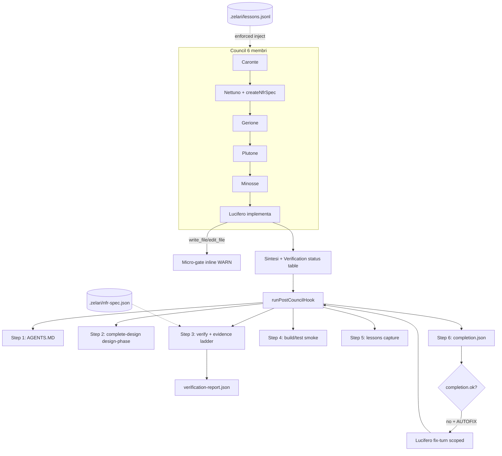

# Council Complete Delivery Roadmap (v0.8.x → v0.9.0)

> **Obiettivo:** Council run che produce **progetti completi, funzionanti, aderenti al prompt**, con intelligenza distribuita tra i 6 ruoli — **senza** over-engineering (niente 7° agente, niente NLP su prosa, niente CI browser pesante).
>
> **Caso di regressione permanente:** `TESTMCP` / motion v0.3.0 (sintesi “verificata” vs codice reale).
>
> **Ispirazione esterna (pattern, non dominio):** T3MP3ST — honesty spine, evidence ladder, harness anti-resa, lessons senza fitting, claim ri-derivabili.

---

## 1. North star — cosa significa “progetto completo”

Un council run in **implementation mode** è “completo” solo se tutte le condizioni sono vere:

| # | Criterio | Verificabile come |
|---|---|---|
| C1 | Il codice richiesto **esiste su disco** | file target presenti, non solo sintesi |
| C2 | Il codice **rispetta i vincoli NFR** del task | `verification-report.json` → `ok: true` su errori bloccanti |
| C3 | La sintesi è **onesta** rispetto al report | niente ✓/“verificato” sopra il tier raggiunto |
| C4 | Il piano e il codice non sono **confusi** | feature in milestone ma assenti → `PLANNED`, mai “compatibile” |
| C5 | **Build/test del progetto** passano quando applicabile | `npm test` / `npm run typecheck` se presenti in `package.json` |
| C6 | **Documentazione minima** allineata | README sezioni/conteggi coerenti (WARN se stale) |
| C7 | Run **non degradato** | provider error / zero tool verify → banner `DEGRADED_RUN` |

**Non richiesto per “completo”:** Lighthouse, axe, browser QA, review umana, 100% task plan.json (il piano può avere backlog esplicito).

---

## 2. Stato attuale (baseline v0.8.0 — fatto)

| Componente | Stato | Path |
|---|---|---|
| Gate A deterministico | ✅ | `packages/core/src/council/verification/` |
| Step 3 `postCouncilHook` | ✅ | `src/cli/workspace/postCouncilHook.ts` |
| UI `[verify] PASS/FAIL` | ✅ | `src/cli/hooks/useChatTurn.ts` |
| `createNfrSpec` tool | ✅ | `src/cli/workspace/stubs.ts` |
| Honesty lint sintesi | ✅ | `honesty.ts` |
| Prompt Lucifero Evidence | ✅ | `packages/core/src/agents/roles.ts` |
| Test unitari | ✅ | `council-verification.test.ts`, `cli-workspace-verification-hook.test.ts` |

**Mancante rispetto al north star:** evidence ladder, in-run gate, retry grep obbligatorio, lessons, cite-verify, verify:council CI, completion artifact, build/test gate, autofix opzionale.

---

## 3. Principi anti-over-engineering

1. **Deterministico prima di LLM** — ogni nuovo controllo deve essere grep/parse/fs o npm script, non un altro agente.
2. **Un solo post-pipeline** — estendere `runPostCouncilHook` (step 4, 5…), non moltiplicare hook in `councilApi`.
3. **Un solo retry pattern** — generalizzare `applyRetryIfMissing` / `runRetryTurnForMember`, non nuovi harness.
4. **NFR strutturati** — `createNfrSpec` + `.zelari/nfr-spec.json`; mai regex su prosa council.
5. **Opt-in per costo** — autofix LLM solo con `ZELARI_VERIFY_AUTOFIX=1`; lesson enforcement solo tier `enforced`.
6. **WARN vs FAIL** — README stale, plan backlog = WARN; motion NFR violati, honesty, build red = FAIL.
7. **Espliciti i limiti** — il report dichiara cosa **non** verifica (bug funzionali JS, Lighthouse).

---

## 4. Architettura target



---

## 5. Evidence ladder (contratto centrale)

Ogni check e ogni riga della sintesi usa un **tier** — la sintesi non può dichiarare un tier superiore a quello del report.

| Tier | Significato | Come si ottiene |
|---|---|---|
| `claimed` | LLM lo afferma | solo prosa (non sufficiente per “completo”) |
| `grep` | Verificato staticamente | Gate A PASS su quel check |
| `tool` | Misurato nel turno | `grep_content` / `bash` / `read_file` emessi da Lucifero |
| `build` | Progetto compila/testa | Step 4: `npm run typecheck` / `npm test` exit 0 |
| `n/a` | Fuori scope | es. v0.2.0 pianificato ma non richiesto nel task |

**Regola sintesi:** tabella `## Verification status` con colonne `Check | Tier | Evidence`.

---

## 6. Piano di implementazione (DAG)

### Fase A — Integrità del claim (v0.8.1) · ~8–10 h

Obiettivo: chiudere il buco “dichiaro verificato senza evidenza” end-to-end.

#### PR-A1 — Evidence ladder nel report e nella sintesi

**Files:**
- `packages/core/src/council/verification/types.ts` — `EvidenceTier`, `tier` su ogni `VerificationCheckResult`
- `packages/core/src/council/verification/runChecks.ts` — assegna tier `grep` ai check deterministici
- `packages/core/src/council/verification/synthesisAudit.ts` — **nuovo**: confronta righe Evidence table vs report; FAIL se tier dichiarato > tier reale
- `packages/core/src/agents/roles.ts` — template tabella con colonna Tier

**Acceptance:**
- Sintesi con “✓ verificato” e report FAIL → `synthesis.tier-inflation` error
- Report JSON include `tier` per ogni risultato

**QA:** test con fixture sintesi TESTMCP-like

---

#### PR-A2 — Cite-verify (path:riga)

**Files:**
- `packages/core/src/council/verification/citeVerify.ts` — **nuovo**
- Parsa `path:L123` / `path:line` dalla sintesi; verifica che il file contenga snippet atteso o linea non vuota
- Integrato in `runImplementationVerification` quando `synthesisText` presente

**Acceptance:**
- `index.html:L9999` in sintesi → FAIL `synthesis.cite-invalid`
- Citazione valida su riga reale → PASS

**QA:** unit test 4 casi (valid, invalid line, missing file, no cite)

---

#### PR-A3 — Micro-gate inline (WARN in stream, non blocco)

**Files:**
- `packages/core/src/agents/councilApi.ts` — dopo tool `write_file`/`edit_file` di Lucifero, se path in `nfr-spec.targets`, run **subset** check (solo file toccato)
- Emette `console.warn` + opzionale brain event `verification_warn` (lightweight, no new agent)

**Acceptance:**
- Scrittura `index.html` con `box-shadow` in `@keyframes` → WARN visibile prima di `message_end`
- Design-phase: micro-gate disattivato

**Non fare:** secondo pass LLM; bloccare il turno a metà.

---

### Fase B — Harness anti-resa (v0.8.2) · ~10–12 h

Obiettivo: Lucifero non può chiudere un implementation run senza almeno un tentativo di verifica tool-based.

#### PR-B1 — Generalizzare `applyRetryIfMissing` → `applyCompletionRetry`

**Files:**
- `packages/core/src/agents/councilApi.ts` — nuovo helper `checkImplementationCompletion(emittedTools, reportPreview)`
- Requisiti OR:
  - almeno 1 `grep_content` o `bash` dopo l’ultimo `write_file`/`edit_file`, **oppure**
  - `ZELARI_VERIFY_SKIP_TOOL=1` (escape hatch dev)
- Se manca → `runRetryTurnForMember` per Lucifero con tools `['grep_content','read_file','bash','edit_file']` e prompt one-liner

**Acceptance:**
- Lucifero scrive file, zero grep, synthesis “completo” → retry forzato 1x
- Dopo retry con grep → nessun secondo retry

**Pattern:** identico a `buildRetryPrompt` / `applyRetryIfMissing` (v0.7.7).

---

#### PR-B2 — Degraded run detection

**Files:**
- `packages/core/src/council/verification/degraded.ts` — **nuovo** (port concettuale da T3MP3ST `DegradedTracker`, semplificato)
- `useChatTurn.ts` — se `chairman errored` OR `provider abort` OR Lucifero zero write ma synthesis “done” → `completion.degraded: true`
- Sintesi deve contenere banner `DEGRADED_RUN` (lint in `synthesisAudit`)

**Acceptance:**
- Council abort mid-run → messaggio system esplicito, non “[verify] PASS”

---

#### PR-B3 — Autofix opzionale (`ZELARI_VERIFY_AUTOFIX=1`)

**Files:**
- `postCouncilHook.ts` — se `report.ok === false` e env set, enqueue fix prompt (single turn Lucifero via `dispatchCouncil` follow-up o inline harness)
- Solo check con severity `error`; max 1 autofix per run

**Acceptance:**
- Con env off: solo report FAIL (comportamento attuale)
- Con env on + TESTMCP fixture: riduce almeno 1 classe FAIL (es. dead-hook)

**Non fare:** loop autofix illimitato.

---

### Fase C — Memoria senza fitting (v0.8.3) · ~6–8 h

Obiettivo: il sistema impara **metodologia**, non risposte (T3MP3ST `lessons.mjs`).

#### PR-C1 — `.zelari/lessons.jsonl`

**Files:**
- `packages/core/src/council/lessons/` — **nuovo**
  - `isAnswerLeak.ts` — flag-shaped secrets, challenge-id + answer pairs
  - `recordFailure.ts` — advisory → enforced on 2nd recurrence (Jaccard su signature)
  - `recallLessons.ts` — top-N enforced per keyword overlap con task
- `postCouncilHook.ts` Step 5 — da ogni FAIL del report, `captureFailure` se non leak

**Acceptance:**
- Lesson con `flag{...}` → rejected at write
- Stessa signature 2x → tier `enforced`

---

#### PR-C2 — Inject lessons nel workspace context

**Files:**
- `src/cli/workspace/planSummary.ts` o nuovo `buildLessonsSummary.ts`
- `useChatTurn.ts` — append a `workspaceContext` prima del council

**Acceptance:**
- Lesson enforced su “synthesis tier inflation” appare nel banner Caronte/Nettuno context
- Max 5 lesson, ~2KB totale

---

#### PR-C3 — `test-no-fitting` per prompt council

**Files:**
- `tests/unit/council-prompt-integrity.test.ts` — **nuovo**
- Scansiona `roles.ts` + `councilDirectives.ts` per: path assoluti noti, numeri benchmark hardcoded, nomi workspace test (TESTMCP, T3MP3ST)

**Acceptance:**
- `npm run test -- council-prompt-integrity` green su main
- Aggiunta di `48183 bytes` nel prompt → test FAIL

---

### Fase D — Progetto funzionante (v0.9.0) · ~8–10 h

Obiettivo: “completo” include build/test quando il repo lo supporta.

#### PR-D1 — Step 4 postCouncilHook: build/test smoke

**Files:**
- `src/cli/workspace/postCouncilHook.ts` — `runProjectSmoke(ctx)`
- Legge `package.json` scripts: prova in ordine `typecheck`, `test`, `build` (primo disponibile)
- Timeout 120s, cattura stdout; tier `build` su PASS

**Acceptance:**
- zelari-code workspace → `npm run typecheck` in hook dopo council che tocca `src/`
- Repo senza scripts → step skipped, non FAIL

**WARN non FAIL** se script mancante; **FAIL** se script esiste e exit ≠ 0.

---

#### PR-D2 — `completion.json` artifact

**Files:**
- `packages/core/src/council/completion/` — **nuovo**
- Aggrega: `verification.ok`, `build.ok`, `degraded`, `tiers`, `openFails[]`, `promptSummary`
- Scritto in `.zelari/completion.json` Step 6

**Acceptance:**
```json
{ "ok": false, "blocking": ["motion.transitions"], "degraded": false, "readyToCommit": false }
```
- `readyToCommit: true` solo se zero blocking errors e non degraded

**UI:** `[completion] readyToCommit=false — 3 blocking issues` in TUI.

---

#### PR-D3 — `npm run verify:council` (contract release)

**Files:**
- `scripts/verify-council.mjs` — **nuovo**
- `package.json` script `verify:council`
- Fixture `tests/fixtures/council-complete/` (minimal + TESTMCP snippet opzionale via env `VERIFY_FIXTURE_ROOT`)

**Acceptance:**
- Exit 0 su fixture “clean”
- Exit 1 su fixture “TESTMCP-like” con ≥3 FAIL attesi
- Documentato in README come `verify-claims` interno

---

### Fase E — Aderenza al prompt e al piano (v0.9.1) · ~6–8 h

Obiettivo: il deliverable corrisponde a **ciò che l’utente ha chiesto**, non al backlog del piano.

#### PR-E1 — Task scope extraction

**Files:**
- `packages/core/src/council/scope/extractTaskScope.ts` — **nuovo**
- Da `userMessage` + `.zelari/nfr-spec.json`: estrae file target, vincoli, espliciti OUT
- Nessun NLP pesante: keyword + file path regex + nfr-spec

**Acceptance:**
- Task “animare index.html” → scope targets `['index.html']`, non command palette
- Scope scritto in `completion.json` → `scope`

---

#### PR-E2 — `buildPlanSummary` enhancement (plan vs richiesta)

**Files:**
- `src/cli/workspace/planSummary.ts`
- Sezione: **“In scope for this task”** vs **“Planned but not requested (backlog)”**
- Usa `extractTaskScope` per non confondere milestone v0.2.0 con task corrente

**Acceptance:**
- Context council su TESTMCP motion task non dice “compatibile con command palette”

---

#### PR-E3 — Design-phase: `createNfrSpec` enforcement (soft)

**Files:**
- `councilApi.ts` — se design-phase + plan contiene keyword motion/perf/budget → warn se `createNfrSpec` non emesso (non retry obbligatorio in v1)
- `DESIGN_PHASE_REQUIREMENT_SETS.nettun` — aggiungere set alternativo OR: `createNfrSpec min 1` solo se task match `NFR_KEYWORDS`

**Acceptance:**
- Design motion plan senza nfr-spec → warning in console; implementation usa DEFAULT_NFR_SPEC

---

## 7. Ordine di merge e milestone

```
Fase A (A1→A2→A3)
Fase B (B1 dipende da A1; B2 parallelo; B3 dipende da B1)
Fase C (C1→C2; C3 parallelo)
Fase D (D1→D2; D3 dipende da D2)
Fase E (E1→E2; E3 parallelo)
```

| Milestone | Versione | Criterio |
|---|---|---|
| **M1 Integrity** | v0.8.1 | Evidence ladder + cite-verify + micro-gate WARN |
| **M2 Anti-stall** | v0.8.2 | Completion retry + degraded + autofix opt-in |
| **M3 Memory** | v0.8.3 | lessons.jsonl + prompt integrity test |
| **M4 Shippable** | v0.9.0 | build smoke + completion.json + verify:council |
| **M5 Prompt-true** | v0.9.1 | scope extraction + plan summary fix |

**Stima totale:** ~38–48 h · 15 PR atomici · 5 milestone

---

## 8. Green-light checklist (release v0.9.0)

Prima di taggare v0.9.0:

- [ ] `npm run test` green (inclusi `council-verification`, `council-prompt-integrity`, `verify:council`)
- [ ] Replay TESTMCP: `completion.json` → `readyToCommit: false` con FAIL espliciti
- [ ] Fixture clean: `readyToCommit: true` dopo council simulato
- [ ] Lucifero retry grep documentato in CHANGELOG
- [ ] Nessun nuovo agente; nessuna dipendenza npm pesante
- [ ] `ZELARI_VERIFY=0` disabilita step 3 (regressione)
- [ ] `ZELARI_VERIFY_AUTOFIX` default off

---

## 9. Esplicitamente fuori scope (non fare)

| Idea | Perché no |
|---|---|
| Minosse pass 2 con tool su ogni run | 7° giro LLM; costo token |
| Lighthouse / axe in CI | Flaky, lento; WARN manuale in task QA se serve |
| Refuter panel LLM (T3MP3ST) | cite-verify deterministico basta per coding |
| Regex NFR su prosa council | Falsi negativi; usare `createNfrSpec` |
| Nuovo agente “Cerbero” | Duplica Gate A + retry |
| Swarm / 8 operatori | Dominio T3MP3ST, non zelari-code |
| Auto-commit / auto-push | L’umano resta nel loop; `readyToCommit` è suggerimento |
| Knowledge map obbligatoria | Già descoped in TESTMCP |

---

## 10. Metriche di successo (4 settimane post-release)

| Metrica | Target |
|---|---|
| Council implementation → `readyToCommit: true` su task smoke | ≥ 80% |
| Sintesi con honesty FAIL | < 5% dei run |
| Retry grep invocato | tracciato; < 30% dei run (indica meno stalli) |
| Lesson enforced attive | ≥ 3 metodologiche, 0 answer-leak |
| Regressioni `verify:council` in CI | 0 |

---

## 11. Fix immediato TESTMCP (opzionale, parallelo al codice)

Per avere un workspace demo “green” senza aspettare v0.9:

1. Rimuovere `box-shadow` da keyframes / transizioni non ammesse **oppure** aggiornare `nfr-spec.json` se il budget è intenzionale
2. Rimuovere hook `.rm` o aggiungere regola CSS
3. Aggiornare README (13 sezioni, ~62 KB)
4. Eseguire `npm run verify:council` con `VERIFY_FIXTURE_ROOT=Z:/EasyPeasy/TESTMCP` dopo PR-D3

---

## 12. Riferimenti nel repo

| Doc / codice | Ruolo |
|---|---|
| `docs/plans/2026-07-05-council-verification-quality-gate.md` | v0.8.0 baseline (completato) |
| `packages/core/src/council/verification/` | Gate A |
| `src/cli/workspace/postCouncilHook.ts` | Pipeline post-run |
| `packages/core/src/agents/councilApi.ts` | Retry pattern da generalizzare |
| T3MP3ST `gate.ts`, `lessons.mjs`, `verify-claims.mjs` | Pattern reference (non dipendenza) |