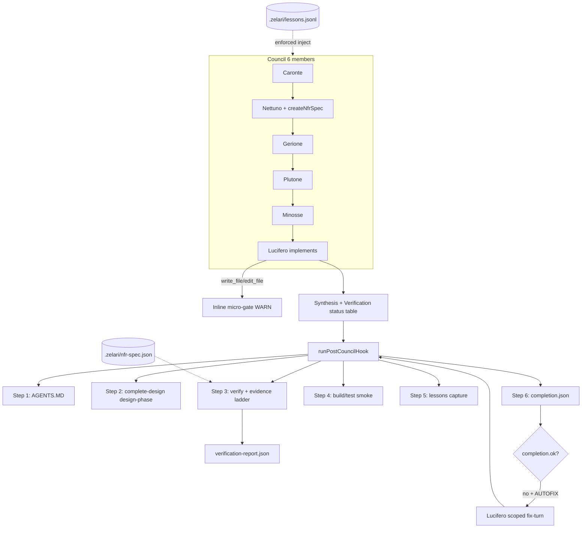

# Council Complete Delivery Roadmap (v0.8.x | v0.9.0)

> **Goal:** a Council run that produces **complete, working projects, faithful to the prompt**, with intelligence distributed across the 6 roles - **without** over-engineering (no 7th agent, no NLP on prose, no heavy browser CI).
>
> **Permanent regression case:** `TESTMCP` / motion v0.3.0 ("verified" synthesis vs real code).
>
> **External inspiration (patterns, not domain):** T3MP3ST - honesty spine, evidence ladder, anti-give-up harness, lessons without fitting, re-derivable claims.

---

## 1. North star - what "complete project" means

A council run in **implementation mode** is "complete" only if all conditions are true:

| # | Criterion | Verifiable as |
|---|---|---|
| C1 | The requested code **exists on disk** | target files present, not just synthesis |
| C2 | The code **respects the task's NFR constraints** | `verification-report.json` | `ok: true` on blocking errors |
| C3 | The synthesis is **honest** vs the report | no V/"verified" above the reached tier |
| C4 | Plan and code are not **confused** | features in milestone but absent | `PLANNED`, never "compatible" |
| C5 | **Project build/test** pass where applicable | `npm test` / `npm run typecheck` if present in `package.json` |
| C6 | **Minimal documentation** aligned | README sections/counts coherent (WARN if stale) |
| C7 | **Non-degraded** run | provider error / zero verify tools | `DEGRADED_RUN` banner |

**Not required for "complete":** Lighthouse, axe, browser QA, human review, 100% of plan.json tasks (the plan may have an explicit backlog).

---

## 2. Current state (baseline v0.8.0 - done)

| Component | State | Path |
|---|---|---|
| Gate A deterministic | ? | `packages/core/src/council/verification/` |
| Step 3 `postCouncilHook` | ? | `src/cli/workspace/postCouncilHook.ts` |
| UI `[verify] PASS/FAIL` | ? | `src/cli/hooks/useChatTurn.ts` |
| `createNfrSpec` tool | ? | `src/cli/workspace/stubs.ts` |
| Synthesis honesty lint | ? | `honesty.ts` |
| Lucifero Evidence prompt | ? | `packages/core/src/agents/roles.ts` |
| Unit tests | ? | `council-verification.test.ts`, `cli-workspace-verification-hook.test.ts` |

**Missing vs the north star:** evidence ladder, in-run gate, mandatory grep retry, lessons, cite-verify, verify:council CI, completion artifact, build/test gate, optional autofix.

---

## 3. Anti-over-engineering principles

1. **Deterministic before LLM** - every new check must be grep/parse/fs or an npm script, not another agent.
2. **One post-pipeline only** - extend `runPostCouncilHook` (steps 4, 5), do not multiply hooks in `councilApi`.
3. **One retry pattern only** - generalize `applyRetryIfMissing` / `runRetryTurnForMember`, no new harnesses.
4. **Structured NFR** - `createNfrSpec` + `.zelari/nfr-spec.json`; never regex over council prose.
5. **Cost opt-in** - LLM autofix only with `ZELARI_VERIFY_AUTOFIX=1`; lesson enforcement only at tier `enforced`.
6. **WARN vs FAIL** - stale README, plan backlog = WARN; violated motion NFR, honesty, red build = FAIL.
7. **Limits made explicit** - the report declares what it does **not** verify (functional JS bugs, Lighthouse).

---

## 4. Target architecture


```mermaid
flowchart TB
    subgraph council [Council 6 members]
        C[Caronte] --> N[Nettuno + createNfrSpec]
        N --> G[Gerione] --> P[Plutone] --> M[Minosse]
        M --> L[Lucifero implements]
    end

    L -->|write_file/edit_file| Micro[Inline micro-gate WARN]
    L --> Synth[Synthesis + Verification status table]

    Synth --> Hook[runPostCouncilHook]
    Hook --> S1[Step 1: AGENTS.MD]
    Hook --> S2[Step 2: complete-design design-phase]
    Hook --> S3[Step 3: verify + evidence ladder]
    Hook --> S4[Step 4: build/test smoke]
    Hook --> S5[Step 5: lessons capture]
    Hook --> S6[Step 6: completion.json]

    S3 --> Report[verification-report.json]
    S6 --> Done{completion.ok?}
    Done -->|no + AUTOFIX| Retry[Lucifero scoped fix-turn]
    Retry --> Hook

    Lessons[(.zelari/lessons.jsonl)] -.->|enforced inject| council
    Nfr[(.zelari/nfr-spec.json)] -.-> S3
```

---

## 5. Evidence ladder (central contract)

Every check and every synthesis line uses a **tier** - the synthesis cannot claim a tier higher than the report's.

| Tier | Meaning | How it is obtained |
|---|---|---|
| `claimed` | The LLM asserts it | prose only (not sufficient for "complete") |
| `grep` | Statically verified | Gate A PASS on that check |
| `tool` | Measured in the turn | `grep_content` / `bash` / `read_file` emitted by Lucifero |
| `build` | Project compiles/tests | Step 4: `npm run typecheck` / `npm test` exit 0 |
| `n/a` | Out of scope | e.g. v0.2.0 planned but not requested in the task |

**Synthesis rule:** a `## Verification status` table with columns `Check | Tier | Evidence`.

---

## 6. Implementation plan (DAG)

### Phase A - Claim integrity (v0.8.1) - ~8-10 h

Goal: close the "I declare verified without evidence" hole end-to-end.

#### PR-A1 - Evidence ladder in the report and the synthesis

**Files:**
- `packages/core/src/council/verification/types.ts` - `EvidenceTier`, `tier` on every `VerificationCheckResult`
- `packages/core/src/council/verification/runChecks.ts` - assigns tier `grep` to deterministic checks
- `packages/core/src/council/verification/synthesisAudit.ts` - **new**: compares Evidence table lines vs report; FAIL if declared tier > real tier
- `packages/core/src/agents/roles.ts` - table template with a Tier column

**Acceptance:**
- Synthesis with "V verified" and a FAIL report | `synthesis.tier-inflation` error
- The JSON report includes `tier` for every result

**QA:** test with a TESTMCP-like synthesis fixture

---

#### PR-A2 - Cite-verify (path:line)

**Files:**
- `packages/core/src/council/verification/citeVerify.ts` - **new**
- Parses `path:L123` / `path:line` from the synthesis; verifies the file contains the expected snippet or a non-empty line
- Integrated into `runImplementationVerification` when `synthesisText` is present

**Acceptance:**
- `index.html:L9999` in the synthesis | FAIL `synthesis.cite-invalid`
- Valid citation on a real line | PASS

**QA:** unit tests for 4 cases (valid, invalid line, missing file, no cite)

---

#### PR-A3 - Inline micro-gate (WARN in stream, not a block)

**Files:**
- `packages/core/src/agents/councilApi.ts` - after Lucifero's `write_file`/`edit_file` tools, if the path is in `nfr-spec.targets`, run a **subset** check (touched file only)
- Emits `console.warn` + optional brain event `verification_warn` (lightweight, no new agent)

**Acceptance:**
- Writing `index.html` with `box-shadow` inside `@keyframes` | visible WARN before `message_end`
- Design-phase: micro-gate disabled

**Do not do:** a second LLM pass; blocking the turn mid-flight.

---

### Phase B - Anti-give-up harness (v0.8.2) - ~10-12 h

Goal: Lucifero cannot close an implementation run without at least one tool-based verification attempt.

#### PR-B1 - Generalize `applyRetryIfMissing` | `applyCompletionRetry`

**Files:**
- `packages/core/src/agents/councilApi.ts` - new helper `checkImplementationCompletion(emittedTools, reportPreview)`
- OR requirements:
  - at least 1 `grep_content` or `bash` after the last `write_file`/`edit_file`, **or**
  - `ZELARI_VERIFY_SKIP_TOOL=1` (dev escape hatch)
- If missing | `runRetryTurnForMember` for Lucifero with tools `['grep_content','read_file','bash','edit_file']` and a one-liner prompt

**Acceptance:**
- Lucifero writes files, zero greps, "complete" synthesis | forced retry 1x
- After a retry with grep | no second retry

**Pattern:** identical to `buildRetryPrompt` / `applyRetryIfMissing` (v0.7.7).

---

#### PR-B2 - Degraded run detection

**Files:**
- `packages/core/src/council/verification/degraded.ts` - **new** (conceptual port of T3MP3ST `DegradedTracker`, simplified)
- `useChatTurn.ts` - if `chairman errored` OR `provider abort` OR Lucifero zero writes but "done" synthesis | `completion.degraded: true`
- The synthesis must contain a `DEGRADED_RUN` banner (lint in `synthesisAudit`)

**Acceptance:**
- Council abort mid-run | explicit system message, not "[verify] PASS"

---

#### PR-B3 - Optional autofix (`ZELARI_VERIFY_AUTOFIX=1`)

**Files:**
- `postCouncilHook.ts` - if `report.ok === false` and the env is set, enqueue a fix prompt (single Lucifero turn via `dispatchCouncil` follow-up or inline harness)
- Only checks with severity `error`; max 1 autofix per run

**Acceptance:**
- Env off: FAIL report only (current behavior)
- Env on + TESTMCP fixture: reduces at least 1 FAIL class (e.g. dead-hook)

**Do not do:** an unlimited autofix loop.

---

### Phase C - Memory without fitting (v0.8.3) - ~6-8 h

Goal: the system learns **methodology**, not answers (T3MP3ST `lessons.mjs`).

#### PR-C1 - `.zelari/lessons.jsonl`

**Files:**
- `packages/core/src/council/lessons/` - **new**
  - `isAnswerLeak.ts` - flag-shaped secrets, challenge-id + answer pairs
  - `recordFailure.ts` - advisory | enforced on 2nd recurrence (Jaccard on signature)
  - `recallLessons.ts` - top-N enforced by keyword overlap with the task
- `postCouncilHook.ts` Step 5 - from every report FAIL, `captureFailure` if not a leak

**Acceptance:**
- A lesson with `flag{...}` | rejected at write
- Same signature 2x | tier `enforced`

---

#### PR-C2 - Inject lessons into the workspace context

**Files:**
- `src/cli/workspace/planSummary.ts` or a new `buildLessonsSummary.ts`
- `useChatTurn.ts` - append to `workspaceContext` before the council

**Acceptance:**
- An enforced lesson on "synthesis tier inflation" appears in the Caronte/Nettuno context banner
- Max 5 lessons, ~2KB total

---

#### PR-C3 - `test-no-fitting` for council prompts

**Files:**
- `tests/unit/council-prompt-integrity.test.ts` - **new**
- Scans `roles.ts` + `councilDirectives.ts` for: known absolute paths, hardcoded benchmark numbers, test workspace names (TESTMCP, T3MP3ST)

**Acceptance:**
- `npm run test -- council-prompt-integrity` green on main
- Adding `48183 bytes` to the prompt | test FAIL

---

### Phase D - Working project (v0.9.0) - ~8-10 h

Goal: "complete" includes build/test when the repo supports it.

#### PR-D1 - postCouncilHook Step 4: build/test smoke

**Files:**
- `src/cli/workspace/postCouncilHook.ts` - `runProjectSmoke(ctx)`
- Reads `package.json` scripts: tries in order `typecheck`, `test`, `build` (first available)
- 120s timeout, captures stdout; tier `build` on PASS

**Acceptance:**
- zelari-code workspace | `npm run typecheck` in the hook after a council touching `src/`
- Repo without scripts | step skipped, not FAIL

**WARN not FAIL** if the script is missing; **FAIL** if the script exists and exit != 0.

---

#### PR-D2 - `completion.json` artifact

**Files:**
- `packages/core/src/council/completion/` - **new**
- Aggregates: `verification.ok`, `build.ok`, `degraded`, `tiers`, `openFails[]`, `promptSummary`
- Written to `.zelari/completion.json` in Step 6

**Acceptance:**
```json
{ "ok": false, "blocking": ["motion.transitions"], "degraded": false, "readyToCommit": false }
```
- `readyToCommit: true` only with zero blocking errors and not degraded

**UI:** `[completion] readyToCommit=false - 3 blocking issues` in the TUI.

---

#### PR-D3 - `npm run verify:council` (release contract)

**Files:**
- `scripts/verify-council.mjs` - **new**
- `package.json` script `verify:council`
- Fixture `tests/fixtures/council-complete/` (minimal + optional TESTMCP snippet via env `VERIFY_FIXTURE_ROOT`)

**Acceptance:**
- Exit 0 on the "clean" fixture
- Exit 1 on the "TESTMCP-like" fixture with the expected >=3 FAILs
- Documented in README as the internal `verify-claims`

---

### Phase E - Prompt and plan adherence (v0.9.1) - ~6-8 h

Goal: the deliverable matches **what the user asked for**, not the plan's backlog.

#### PR-E1 - Task scope extraction

**Files:**
- `packages/core/src/council/scope/extractTaskScope.ts` - **new**
- From `userMessage` + `.zelari/nfr-spec.json`: extracts target files, constraints, explicit OUTs
- No heavy NLP: keywords + file path regex + nfr-spec

**Acceptance:**
- Task "animate index.html" | scope targets `['index.html']`, not the command palette
- Scope written into `completion.json` | `scope`

---

#### PR-E2 - `buildPlanSummary` enhancement (plan vs request)

**Files:**
- `src/cli/workspace/planSummary.ts`
- Section: **"In scope for this task"** vs **"Planned but not requested (backlog)"**
- Uses `extractTaskScope` to avoid confusing the v0.2.0 milestone with the current task

**Acceptance:**
- The council context on the TESTMCP motion task does not say "compatible with the command palette"

---

#### PR-E3 - Design-phase: `createNfrSpec` enforcement (soft)

**Files:**
- `councilApi.ts` - if design-phase + plan contains motion/perf/budget keywords | warn if `createNfrSpec` was not emitted (no mandatory retry in v1)
- `DESIGN_PHASE_REQUIREMENT_SETS.nettun` - add an alternative OR set: `createNfrSpec min 1` only if the task matches `NFR_KEYWORDS`

**Acceptance:**
- Motion design plan without nfr-spec | warning in console; implementation uses DEFAULT_NFR_SPEC

---

## 7. Merge order and milestones

```
Phase A (A1|A2|A3)
Phase B (B1 depends on A1; B2 parallel; B3 depends on B1)
Phase C (C1|C2; C3 parallel)
Phase D (D1|D2; D3 depends on D2)
Phase E (E1|E2; E3 parallel)
```

| Milestone | Version | Criterion |
|---|---|---|
| **M1 Integrity** | v0.8.1 | Evidence ladder + cite-verify + micro-gate WARN |
| **M2 Anti-stall** | v0.8.2 | Completion retry + degraded + opt-in autofix |
| **M3 Memory** | v0.8.3 | lessons.jsonl + prompt integrity test |
| **M4 Shippable** | v0.9.0 | build smoke + completion.json + verify:council |
| **M5 Prompt-true** | v0.9.1 | scope extraction + plan summary fix |

**Total estimate:** ~38-48 h - 15 atomic PRs - 5 milestones

---

## 8. Green-light checklist (release v0.9.0)

Before tagging v0.9.0:

- [ ] `npm run test` green (including `council-verification`, `council-prompt-integrity`, `verify:council`)
- [ ] TESTMCP replay: `completion.json` | `readyToCommit: false` with explicit FAILs
- [ ] Clean fixture: `readyToCommit: true` after a simulated council
- [ ] Lucifero grep retry documented in the CHANGELOG
- [ ] No new agent; no heavy npm dependency
- [ ] `ZELARI_VERIFY=0` disables step 3 (regression)
- [ ] `ZELARI_VERIFY_AUTOFIX` default off

---

## 9. Explicitly out of scope (do not do)

| Idea | Why not |
|---|---|
| Minosse pass 2 with tools on every run | 7th LLM round; token cost |
| Lighthouse / axe in CI | Flaky, slow; manual WARN in task QA if needed |
| LLM refuter panel (T3MP3ST) | deterministic cite-verify is enough for coding |
| NFR regex over council prose | False negatives; use `createNfrSpec` |
| New "Cerbero" agent | Duplicates Gate A + retry |
| Swarm / 8 operators | T3MP3ST domain, not zelari-code |
| Auto-commit / auto-push | The human stays in the loop; `readyToCommit` is a suggestion |
| Mandatory knowledge map | Already descoped in TESTMCP |

---

## 10. Success metrics (4 weeks post-release)

| Metric | Target |
|---|---|
| Council implementation | `readyToCommit: true` on smoke tasks | >= 80% |
| Syntheses with honesty FAIL | < 5% of runs |
| Grep retry invoked | tracked; < 30% of runs (indicates fewer stalls) |
| Active enforced lessons | >= 3 methodological, 0 answer-leak |
| `verify:council` regressions in CI | 0 |

---

## 11. Immediate TESTMCP fix (optional, parallel to the code)

To have a "green" demo workspace without waiting for v0.9:

1. Remove `box-shadow` from keyframes / disallowed transitions **or** update `nfr-spec.json` if the budget is intentional
2. Remove `.rm` hooks or add a CSS rule
3. Update the README (13 sections, ~62 KB)
4. Run `npm run verify:council` with `VERIFY_FIXTURE_ROOT=Z:/EasyPeasy/TESTMCP` after PR-D3

---

## 12. References in the repo

| Doc / code | Role |
|---|---|
| `docs/plans/2026-07-05-council-verification-quality-gate.md` | v0.8.0 baseline (completed) |
| `packages/core/src/council/verification/` | Gate A |
| `src/cli/workspace/postCouncilHook.ts` | Post-run pipeline |
| `packages/core/src/agents/councilApi.ts` | Retry pattern to generalize |
| T3MP3ST `gate.ts`, `lessons.mjs`, `verify-claims.mjs` | Pattern reference (not a dependency) |
