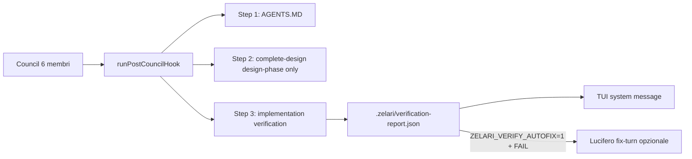

# Council Verification Quality Gate (v0.8.0) — revisione slim

> **Goal:** Eliminare errori post-council (claim “verificato” senza evidenza, NFR violati nel codice, piano confuso con realtà) **senza** un 7° giro LLM. Caso di regressione: TESTMCP / motion v0.3.0.

**Architecture:** Gate **deterministico** come Step 3 di `runPostCouncilHook` (implementation-only). NFR da **emissione strutturata** (`createNfrSpec`), non regex su prosa. Fix-turn opzionale via pattern `applyRetryIfMissing` solo se `ZELARI_VERIFY_AUTOFIX=1`.

**Non obiettivi:** Minosse pass 2 con tool, Lighthouse CI, nuovo agente permanente, NLP su output council.

---

## Diagnosi (invariata)

Manca un gate tra “ho scritto il file” e “dichiaro il lavoro finito”. Lucifero implementa e auto-valuta. Minosse in implementation non legge il codice (`tools: []`).

---

## Principi (revisione)

1. **Deterministico prima di LLM** — l’80% dei FAIL TESTMCP è grep/parse.
2. **Integrare l’esistente** — `postCouncilHook` + `applyRetryIfMissing`, non nuovi hook in `councilApi`.
3. **NFR strutturati** — `createNfrSpec` → `.zelari/nfr-spec.json`; default sensati se assente.
4. **Fail visible** — report JSON + messaggio system in TUI.
5. **Onestà lessicale** — lint sulla sintesi Lucifero (no ✓ senza report PASS).

---

## Architettura

### Check deterministici (Gate A)

| ID | Scope | Note |
|---|---|---|
| `motion.keyframes` | `@keyframes` | Proprietà non ammesse da `nfr-spec` |
| `motion.transitions` | `transition` / `transition-property` | **Include** FAQ `grid-template-rows`, `padding`, `box-shadow` |
| `inline-js.budget` | primo `<script>` inline | Byte UTF-8 |
| `css.dead-hook` | `classList.add('x')` senza regola `.x` | Es. `.rm` morto |
| `plan.reality` | milestone vs file target | Feature pianificate assenti |
| `docs.readme-stale` | README vs file reale | WARN, non blocca |
| `synthesis.honesty` | testo sintesi vs report | ✓/verificato senza PASS |

**Limiti dichiarati:** non coglie bug funzionali JS (FAQ che scatta), Lighthouse, axe.

---

## 4 PR (DAG)

### PR-1 — Verification engine

- `packages/core/src/council/verification/*`
- `tests/unit/council-verification.test.ts`
- Export `@zelari/core/council` (verification)

### PR-2 — `createNfrSpec` tool

- `src/cli/workspace/stubs.ts` — persiste `.zelari/nfr-spec.json`
- `roles.ts` — Nettuno/Minosse: menzione obbligatoria in design-phase
- Default spec quando file assente

### PR-3 — `postCouncilHook` Step 3

- `postCouncilHook.ts` — `runImplementationVerification`, implementation-only
- `useChatTurn.ts` — surface FAIL in chat
- Opzionale: autofix env flag (fase 2)

### PR-4 — Honesty lint + UI

- `honesty.ts` — già in PR-1, wired in Step 3 con `synthesisText`
- Prompt Lucifero: tabella Evidence obbligatoria

---

## Green-light

- [ ] `verification-report.json` presente dopo council implementation
- [ ] `ok: true` **oppure** sintesi dice “VERIFICA INCOMPLETA” / elenca FAIL
- [ ] Nessun ✓ su Lighthouse/axe/CLS senza evidenza nel report

---

## Stima: ~12–16 h, 4 PR atomici