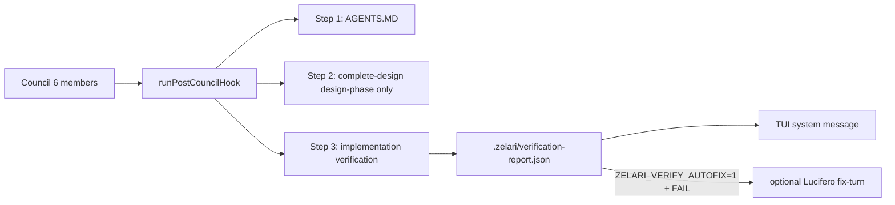

# Council Verification Quality Gate (v0.8.0) - slim revision

> **Goal:** Eliminate post-council errors (claims of "verified" without evidence, NFRs violated in code, plan confused with reality) **without** a 7th LLM round. Regression case: TESTMCP / motion v0.3.0.

**Architecture:** A **deterministic** gate as Step 3 of `runPostCouncilHook` (implementation-only). NFRs come from **structured emission** (`createNfrSpec`), not regex over prose. Optional fix-turn via the `applyRetryIfMissing` pattern only when `ZELARI_VERIFY_AUTOFIX=1`.

**Non-goals:** Minosse pass 2 with tools, Lighthouse CI, a new permanent agent, NLP on council output.

---

## Diagnosis (unchanged)

A gate is missing between "I wrote the file" and "I declare the work finished". Lucifero implements and self-grades. Minosse in implementation does not read code (`tools: []`).

---

## Principles (revision)

1. **Deterministic before LLM** - 80% of TESTMCP FAILs are grep/parse.
2. **Integrate the existing** - `postCouncilHook` + `applyRetryIfMissing`, not new hooks in `councilApi`.
3. **Structured NFRs** - `createNfrSpec` -> `.zelari/nfr-spec.json`; sensible defaults when absent.
4. **Fail visible** - JSON report + system message in the TUI.
5. **Lexical honesty** - lint on the Lucifero synthesis (no checkmark without a PASS report).

---

## Architecture

```mermaid
flowchart LR
    Council[Council 6 members] --> Hook[runPostCouncilHook]
    Hook --> S1[Step 1: AGENTS.MD]
    Hook --> S2[Step 2: complete-design design-phase only]
    Hook --> S3[Step 3: implementation verification]
    S3 --> Report[.zelari/verification-report.json]
    Report --> UI[TUI system message]
    Report -->|ZELARI_VERIFY_AUTOFIX=1 + FAIL| Fix[optional Lucifero fix-turn]
```

### Deterministic checks (Gate A)

| ID | Scope | Notes |
|---|---|---|
| `motion.keyframes` | `@keyframes` | Properties not allowed by `nfr-spec` |
| `motion.transitions` | `transition` / `transition-property` | **Includes** the FAQ `grid-template-rows`, `padding`, `box-shadow` |
| `inline-js.budget` | first inline `<script>` | UTF-8 bytes |
| `css.dead-hook` | `classList.add('x')` without a `.x` rule | E.g. dead `.rm` |
| `plan.reality` | milestone vs target files | Planned features absent |
| `docs.readme-stale` | README vs real files | WARN, does not block |
| `synthesis.honesty` | synthesis text vs report | Checkmark/"verified" without PASS |

**Declared limits:** does not catch functional JS bugs (the FAQ that fires), Lighthouse, axe.

---

## 4 PRs (DAG)

### PR-1 - Verification engine

- `packages/core/src/council/verification/*`
- `tests/unit/council-verification.test.ts`
- Export `@zelari/core/council` (verification)

### PR-2 - `createNfrSpec` tool

- `src/cli/workspace/stubs.ts` - persists `.zelari/nfr-spec.json`
- `roles.ts` - Nettuno/Minosse: mandatory mention in design-phase
- Default spec when the file is absent

### PR-3 - `postCouncilHook` Step 3

- `postCouncilHook.ts` - `runImplementationVerification`, implementation-only
- `useChatTurn.ts` - surface FAIL in chat
- Optional: autofix env flag (phase 2)

### PR-4 - Honesty lint + UI

- `honesty.ts` - already in PR-1, wired in Step 3 with `synthesisText`
- Lucifero prompt: mandatory Evidence table

---

## Green-light

- [ ] `verification-report.json` present after an implementation council
- [ ] `ok: true` **or** the synthesis says "VERIFICATION INCOMPLETE" / lists FAILs
- [ ] No checkmark on Lighthouse/axe/CLS without evidence in the report

---

## Estimate: ~12-16 h, 4 atomic PRs